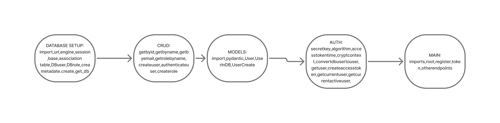

# My learnings related to authentication and authorization setup for FastAPI.

## Sarting from database.py.
  * Thing to import `sqlalchemy.orm,sqlalchemy,declarative_base,sessionmaker,Integer,Boolean,String,ForeignKey,relationship,sqlalchemy.ext.declarative,sqlalchemy.sql,func`
  * Then we make constants like `DB-url,engine,SessionLocal`
  * DB-url starts with postgresql,driver,://,username,password,IP,port,database.
  * engine create_engine DB-url,echo.
  * SessionLocal -> sessionmaker,autocommit,autoflust,bind=engine.
  * Base -> declarative_base()  ORM
  * Association table for many to many
  * 
